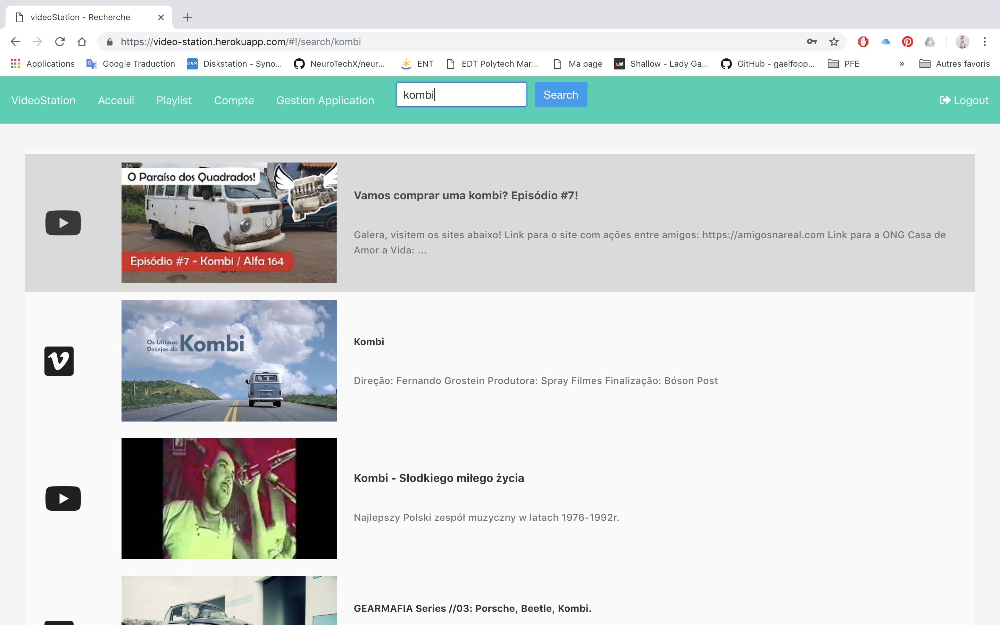

<h1 align="center">
​    videoStation
</h1>


videoStation was a school project meant to teach us security and scalability of today Web apps.

|            Login            |            Register             |            Search Video            |
| :-------------------------: | :-------------------------: | :-------------------------: |
|  |  |  |

|            Playlist            |            Video             |            Historique            |
| :-------------------------: | :-------------------------: | :-------------------------: |
|  |  |  |


The project offers 4 web servers, a pilot and three silos.

The pilot is the main server serving the web interface, handling requests and distributing them to the silos.

The backend is developed with [nodeJS](http://nodejs.org/), the frontend with [AngularJS](https://angularjs.org/) and [Bulma](bulma.io).

## Getting Started

### Prerequisites

To run this project, you will need :

- [nodeJS](http://nodejs.org/) 9.4.0+
- [MongoDB](https://www.mongodb.com/) 3.4+

### Installing

To build this project, simply clone this repository and install the dependencies of the three servers:

```shell
git clone https://github.com/gaelfoppolo/videoStation
```

|     Pilote     |      Users       |      Video       |      Historique       |
| :-----------: | :--------------: | :--------------: | :--------------: |
|  `cd pilote`  | `cd silos/users` | `cd silos/videos` | `cd silos/historiques` |
| `npm install` |  `npm install`   |  `npm install`   |  `npm install`   |

#### Generate SSL certificates

The first step is to create a private key:

```sh
openssl genrsa -des3 -out server_private.key 2048
```

Once the key is generated, issue a certificate signing request:

```sh
openssl req -new -key server_private.key -out server_certificate.csr
```

Now, it is required to enter the pass-phrase when using the key from the `server_private.key` file. Since I assume you will only use the certificate for testing purposes, we can remove the password protection. 

```sh
openssl rsa -in server_private.key -out server_private_clear.key
```

Finally, we have to self-sign the certificate. The created certificate will expire in 365 days after issuing:

```sh
openssl x509 -req -days 365 -in server_certificate.csr -signkey server_private_clear.key -out server_cert_final.crt
```

The self-signed certificate will generate an error in browsers. The reason is that the 
signing certificate authority is unknown and therefore not trusted. But that's okay, it's for testing. ;)

You can now copy the private key (`server_private_clear.key`) and the self-signed certificate (`server_cert_final.crt`)  to the appropriate folder, in `pilote/server-cert`.

### Running

You can run the servers independently, but you need them all to use the app completely:

|     Pilote     |      Users       |      Video       |      Historique       |
| :-----------: | :--------------: | :--------------: | :--------------: |
|  `cd pilote`  | `cd silos/users` | `cd silos/videos` | `cd silos/historiques` |
| `node app.js` |  `node app.js`   |  `node app.js`   |  `node app.js`   |

Do not forget to launch the two MongoDB servers, one for each silos:

|         Users          |         Video         |         Historique         |
| :--------------------: | :-------------------: | :-------------------: |
| ` mongod --port 12345` | `mongod --port 12346` | `mongod --port 12347` |

_Note: you can specify the folder where to store the database by adding the following option: `--dbpath /path/to/folder`_.
### Admin mode
The first admin account may be created by changing the field "type" in user database by "ADMIN".
### Usage

Using the default settings, simply browse to https://localhost:8080. You can:

- login
- register
- search video
- create/remove playlist
- look history

Otherwise, there is a example online : https://video-station.herokuapp.com/#!/login

## Customization

The project uses YAML config files to define global settings such as: server host, server port, API endpoints, etc. You can edit them as you like.

|                  Pilot                   |                  Users                   |                  Videos                   |                  Historiques                   |
| :--------------------------------------: | :--------------------------------------: | :--------------------------------------: | :--------------------------------------: |
| `pilote/config/server-config.yml` `pilote/config/silos-config.yml` | `silos/users/config/server-config.yml` `silos/users/config/database-config.yml` | `silos/videos/config/server-config.yml` `silos/videos/config/database-config.yml` | `silos/historiques/config/server-config.yml` `silos/historiques/config/database-config.yml` |


## Author

- **Adrien Morel** - *Initial work* - [gaelfoppolo](https://github.com/adrienmorel)

